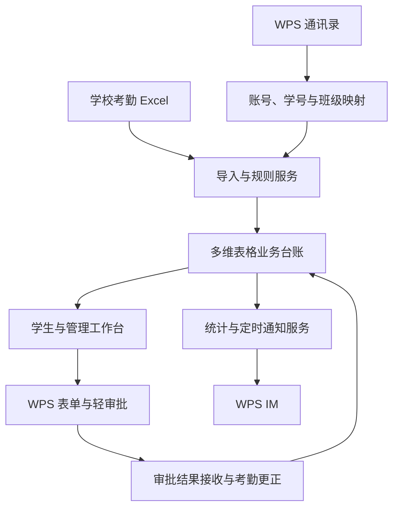

# 基于 WPS 365 的课堂考勤管理系统总体设计

本项目利用学校已有的组织和协作能力，把学校考勤记录加工为学院认可的考勤结果，提供个人查询、异常申诉、请假审批、每日通知和管理统计。优先复用已搭建的多维表格场景，由 Comate 实现缺少的业务逻辑与界面。

## 1 业务目标与规模

业务目标是减少人工整理和重复核对，让每条考勤都对应到正确的学生，让每次更正都有依据，让学生及时发现问题，让辅导员掌握异常和待办。

v4 文档记载的学院规模为 2,432 名学生、66 个班级、单周 31,792 条考勤、一学期约 60 万条以上。这些是设计容量输入，不是本次重新测量结果。平台超过 100 万行的能力采用用户提供的前提；具体表容量、关联性能、接口吞吐另行验证。

本期以已有学校考勤系统导出的 Excel 为输入。课程二维码样例保留作参考，本期不自动扩展为另一套签到采集系统。

## 2 系统分工

| 能力 | 首选承载 | Comate 实施内容 | 需要核实的边界 |
|---|---|---|---|
| 登录与组织身份 | WPS 365 账号、通讯录 | 获取已认证用户，关联学号及班级，维护角色范围 | 用户 ID 类型、可读组织字段、学生账号覆盖 |
| 业务台账 | WPS 多维表格 | 建表和关联、批次导入、记录版本、历史归档 | API 筛选分页、批量写入、更新冲突处理 |
| 数据采集表单 | WPS 表单或多维表格表单 | 请假和申诉表单、附件、身份锁定、提交校验 | 登录身份注入、防改填、字段联动、访问控制 |
| 审批过程 | WPS 轻审批 | 配置请假、申诉、撤销流程；动态选审批人；结果联动 | 动态审批人、排除本人、转办、回调或结果查询 |
| 消息触达 | WPS IM | 个人日报、审核结果、审核待办、辅导员日报、失败重试 | 接收人 ID、权限、频率、回执和消息跳转 |
| 管理视图和看板 | 多维表格视图、仪表盘 | 按角色开放视图、班级和日期汇总、异常趋势 | 真实行权限、汇总筛选性能、导出权限 |
| 规则和跨应用联动 | Comate 开发的业务服务 | 判定、去重、更正、版本控制、调度、对账 | 服务部署环境、持久任务、平台触发能力 |
| 学生和审核工作台 | 原生应用页优先，必要时定制页面 | 移动端查询、流程进度、待办、错误提示 | 内嵌方式、登录态传递、服务端权限校验 |

这里的“业务服务”是设计上的逻辑组件，可以运行在经验证的平台扩展环境或学校认可的应用运行环境。是否独立部署由能力核验决定，不预先指定 FastAPI、React 或某一种数据库。

## 3 总体结构

图中箭头表示设计的数据流。表单到审批、审批到业务服务是否有原生连接器或回调，需要在本校租户验证。没有直接回调时优先使用经验证的审批状态查询，不把未验证能力写成已打通。

## 4 现有样例如何复用

| 截图可见对象 | 已体现的业务思路 | 本轮复用设计 |
|---|---|---|
| 班级信息 | 学院、班级、年级、副班长、辅导员等对应关系 | 保留结构，人员字段转换或映射到账号 ID，增加有效期和权限范围 |
| 学生信息 | 存在学生基础信息表入口 | 导出真实字段后映射到学生档案；不假定已含全部账号关系 |
| 课程信息管理 | 课程、教师、周次、星期、日期、节次、地点、班级 | 分离课程定义与具体日期课次；保留课程类型、原节次字符串 |
| 课程二维码标签 | 一门课程或课次关联二维码 | 本期只盘点和留存，不视为已有签到真实性校验能力 |
| 学生课程总表 | 学生与课程关联，按班级和课程分组 | 作为选课关系/学生课程关系来源，避免每天全量复制学生乘课程数据 |
| 今日课程、是否需要打卡 | 通过关联和公式形成当天视图 | 用于当日操作辅助；历史台账必须存固定业务日期和判定快照 |
| 课程签到明细 | 已有签到明细入口 | 查清来源、字段和覆盖范围；学校 Excel 为一期默认权威来源 |
| 请假登记表、请假表单、状态查询 | 已有请假录入及查询雏形 | 保留入口思路，增加可信身份、日期节次范围、附件、轻审批实例和结果状态 |
| 打卡状态、考勤情况确认 | 自动计算与人工确认分开 | 分成原始结果、基础判定、请假覆盖、人工结论、最终结果及证据 |
| 班级考勤记录、今日班级考勤、仪表盘 | 班级层管理和统计 | 基于同一考勤明细生成汇总，不再人工维护另一份最终结果 |

截图中的“无需打卡”“正常打卡”和班级人数为 0 等只反映样例显示，不据此判断历史数据、公式或现有系统是否正确。实施前必须取得真实字段配置、关联、公式及权限导出。

## 5 一期功能范围

一期应交付以下完整业务：

1. WPS 身份接入、学生映射、班级人员和审核角色配置。
2. 名册与学校 Excel 导入、字段校验、重复识别、未匹配记录隔离。
3. 考勤自动判定和待处理核对，保留判定理由及规则版本。
4. 学生查看本人历史考勤和统计。
5. 请假申请、辅导员审批、多人公假、撤销审批及考勤重算。
6. 申诉一审和二审、防自审、超时转办、终审结果公示和锁定。
7. 学生每日个人考勤通知、异常提醒、审批结果通知及辅导员日报。
8. 班级/学院看板、导出、操作审计、同步异常与消息失败处理。

二期候选：学校考勤 API 自动接入、更多学院推广、课程二维码签到采集、教师课堂实时考勤入口。它们不作为一期默认交付范围。

## 6 从 v4 到本方案的决策表

| 编号 | 事项 | 本轮设计 | 状态和影响 |
|---|---|---|---|
| D01 | 数据存储路线 | 多维表格作为业务主台账 | 用户条件驱动的架构调整；取消独立 SQLite 为默认路线 |
| D02 | 身份与登录 | 复用 WPS；通过可信名册绑定学号 | 本轮设计；不再采用学号加手机号后四位作为生产登录兜底 |
| D03 | 审批引擎 | 优先使用轻审批，业务服务接收结果并更正台账 | 接口能力待实测；不并行建设两套可写审批状态 |
| D04 | 学生个人日报 | 纳入一期；默认当日有考勤的学生均收到本人汇总 | 满足原始诉求；具体时间默认北京时间 21:00，可配置 |
| D05 | 管理范围 | 本期学院；数据和账号带学院范围 | 全校 WPS 普及不扩大一期业务范围 |
| D06 | 刷卡规则 | 保留 v4：原始正常加刷卡，基础判定为旷课 | 沿用待业务负责人确认；用规则版本控制，不硬编码为不可改政策 |
| D07 | 未知结果或未知方式 | 待处理，不猜测为正常或旷课 | 采用 v4 防御性设计 |
| D08 | 早退申诉 | 保留 v4 默认关闭，可配置扩展 | 待业务确认；验收必须覆盖开启和关闭两种配置 |
| D09 | 请假匹配顺序 | 先算基础判定，再对基础旷课应用已批准请假 | 消除 v4 对“刷卡转旷课是否覆盖”的歧义；上线前确认 |
| D10 | 人工结论与请假 | 有效人工结论优先；请假不静默覆盖它，冲突进入复核 | 明确 v4 人工结论保护；上线前确认优先级 |
| D11 | 公示范围 | 本人可见七天倒计时；有管理权限者可查 | 沿用 v4，不默认全班互相公开 |
| D12 | 公假发起人 | 学生干部、辅导员可发起多人公假；普通学生不默认开放 | 采用 v4 权限矩阵；确认是否允许普通学生申请单人公假 |
| D13 | 数据导入不完整 | 不将缺记录视为旷课；日报明确数据未齐 | 本轮补充的数据质量规则 |
| D14 | 学生干部二审范围 | 默认仅授权班级；本人申诉转有权限的其他干部或辅导员 | 不默认给所有学生干部全院权限 |
| D15 | 辅导员范围 | 本期按 v4 可查看和兜底全院；常规待办按负责班级路由 | 多学院推广时增加学院隔离；全院权限由角色授予 |
| D16 | 公示起算 | 终审批准且考勤实际更正后开始七天，保留原审批时间 | 为异步联动补充；相较 v4 纯终审起算可能后移，须确认 |
| D17 | 异常统计 | 旷课＋迟到＋早退；待核实单列；v4 旷课＋待处理命名为需关注 | 指标口径调整，须确认后发布，不能直接混用旧日报数据 |
| D18 | 待处理本人核对 | 也执行防自审，转其他授权人或辅导员 | 在 v4 申诉防自审基础上的补充约束 |
| D19 | 请假证据可见性 | 班级管理人员可看进度，病假证据默认仅本人和对应辅导员可看 | 在 v4 只读旁观基础上细化字段权限 |
| D20 | 未匹配学生 | 原始记录隔离待映射，不建立无学号可登录账号 | 替代 v4 自动补建空学号学生的默认行为 |
| D21 | 锁定后自动事件 | 不直接改判，形成辅导员复核任务 | 明确请假/来源更正与公示锁定冲突的处理 |
| D22 | 多人公假跨范围 | 一单默认同一负责辅导员，跨范围拆单 | 新增路由边界；如需跨辅导员一单会签，单独扩展 |
| D23 | 公示期内新异议 | 不开平行申诉，通过辅导员复核处理 | 补全 v4 公示期内重复申诉边界，须业务确认 |

这是一份可实施设计稿。Comate 可按上述默认值完成开发与模拟测试；涉及真实学生的自动改判和通知，应使用业务方确认的规则版本。

## 7 明确不做重复建设

- 不新建另一套学生密码和组织通讯录。
- 不要求学生直接打开有全班数据编辑权限的底表。
- 不用截图中的姓名文本承担账号身份或审批人身份。
- 不把所有历史记录放进依赖 TODAY() 动态计算的“今日表”。
- 不让多维表格公式、轻审批动作和扩展代码各自写一个“最终结果”。最终判定统一由业务服务写入，其他组件提交请求或展示结果。
- 不用大模型自由判断某学生是否旷课。Comate 辅助开发，生产判定采用可解释、可测试的确定性规则。

## 8 平台复用与可靠性的取舍

多维表格具备大容量是复用的前提，不能据此推断它自动具备关系数据库的事务、唯一键或并发锁。默认采用单一写入通道、持久任务、记录版本、事件去重和定期对账；是否能完全运行在平台内由验证结果决定。

若平台不能提供可靠的任务持久化或并发控制，使用学校认可的轻量运行支撑保存任务、锁和发送记录，业务主台账仍在多维表格。只有真实测试证明业务台账本身无法承载，并形成证据和变更评审后，才重新评估存储路线。

## 9 交付物和可用标准

Comate 最终交付：可运行工程与部署说明、平台配置清单、真实字段与模板映射、规则配置、导入操作手册、备份恢复说明、已执行验收证据、已知限制清单。不得只交付提示词或前端演示。

验收须跑通“Excel 导入—个人查询—请假/申诉—考勤更正—统计更新—IM 通知”，同时验证越权访问、重复回调、任务中断和消息失败。
