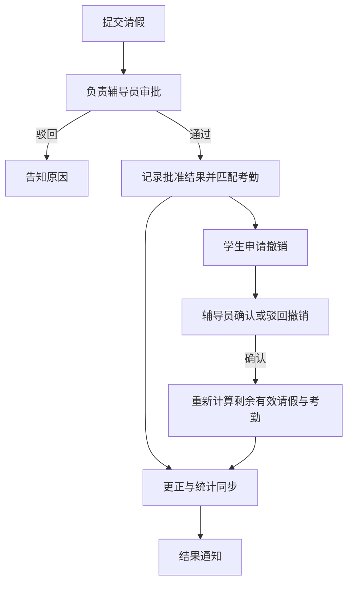

# 业务规则 流程与页面设计

以下为确定性业务规则。Comate 按规则实现，不用大模型对个体出勤进行自由推断。所有待确认口径见 01 决策表。

## 1 考勤导入流程

1. 辅导员上传学校 Excel，选择学期，系统识别列名并展示预览。字段包含姓名、班级名称、课程名称、上课老师、课程节次、教室位置、周次、签到时间、考勤结果、生成日期、考勤方式。
2. 校验必需字段、日期、节次和班级名称映射。生成日期是否等于上课日期须用真实文件确认；若不是，必须取得真实上课日期，禁止直接替代。
3. 名册通过“姓名＋发生时班级”产生身份候选，唯一匹配后关联 student_id。缺失或同班同名时隔离为数据异常，不发送学生消息，不猜学号。
4. 保留原始行和文件摘要，生成业务键与内容摘要。重复不新增；同键内容不同进入来源更正流程。
5. 执行规则计算，并写入带版本的正式考勤。待处理是考勤业务状态；未匹配、无日期等是导入数据错误，两类队列分开。
6. 分批提交，批大小由接口实测确定；记录成功和失败的行以及检查点。重跑只处理未完成部分或已识别的重复部分。
7. 重算受影响的学生日、班级日和学院日汇总。显示导入分布及完整性状态。
8. 辅导员可确认某日/某班数据已齐。系统不能仅凭“导入成功”推断覆盖全部应到学生。

## 2 考勤判定顺序

### 2.1 基础判定

| 原始结果 | 原始方式 | 基础结果 |
|---|---|---|
| 正常 | 刷脸、istudy、二维码 | 正常 |
| 正常 | 刷卡 | 旷课 |
| 正常 | 空值或未知方式 | 待处理 |
| 迟到 | 任意方式 | 迟到 |
| 早退 | 任意方式 | 早退 |
| 旷课 | 任意方式 | 旷课 |
| 其他未识别结果 | 任意方式 | 待处理 |

方式值可去首尾空格、按经确认的别名表规范化；保留原始字符串。不自行扩展有效方式集合。v4 中“正常＋刷卡”为旷课属于业务政策，必须以经确认的规则版本上线。

### 2.2 最终判定

```text
基础结果 = 按原始结果和方式计算
有效请假 = 已批准、撤销未确认、覆盖该学生/日期/节次的请假单并集
若存在有效人工结论：采用该人工结论；与请假或新来源冲突则列入辅导员复核
否则若基础结果是旷课且存在有效请假：最终结果 = 请假
否则：最终结果 = 基础结果
```

适用说明：

- 请假只覆盖基础旷课，不自动消除迟到、早退或待处理。
- 待处理被人工确认为缺勤后，生成明确的人工结论；若已有请假冲突，要求辅导员复核后更正，不能静默隐藏冲突。
- 人工结论包括待处理核对、申诉成立、辅导员手动改判。只有授权人员显式撤销/替换该结论，才能重新采用自动结果。
- 多张请假并集生效；撤销其中一张后重新检查其余有效单，不能直接恢复为旷课。
- 公示锁定后拒绝普通自动改判；后续收到的来源更正、请假变动形成复核任务，由辅导员带理由处理。保留原事实和新事件。

回归参照：v4 所述 31,792 行样本，在无请假、无人工更正的条件下应得正常 15,442、旷课 14,185、待处理 2,001、迟到 164。真实样本 Excel 本轮未提供，此项验收须获得文件后执行；不能用生成相同数量的模拟行冒充真实数据回归。

## 3 待处理核对

触发：基础判定为待处理。副班长/有权限的学生干部只核对授权班级；辅导员可处理全院。

核对页面显示原始结果、方式、时间、课程、日期节次及待处理原因。操作为“确认到场”“确认缺勤”，必须填写说明；可选附证据。涉及本人记录时，不允许自核对，转其他授权审核人或辅导员。

提交时校验记录版本；已被别人处理则刷新并提示，不覆盖新结果。成功后生成判定事件、更新明细和统计、通知学生。批量核对必须列出明确选中的记录，逐条执行权限与本人排除，不能一键把全部空方式判正常。

## 4 请假流程

### 4.1 表单

身份从当前登录账号获取，姓名、学号、班级只读显示。代办时单独显示申请人和受益学生，不混淆两者。

必填：请假类型、开始日期、结束日期、全天/指定节次、理由。病假必传附件，其他类型可选。节次为 1—12 的集合，按日期范围内每天相同节次生效；不同日期不同节次需要拆单，或后续扩展为明细区间，不能隐含猜测。

多人公假由学生干部或辅导员发起，人员选择限制在其授权范围，展示人数与名单。跨班成员按各自班级路由给负责辅导员；一期建议一单只包含同一负责辅导员范围内的学生，跨范围自动提示拆单。本人、发起人、受益人分别记录。

### 4.2 流转



轻审批为审批过程权威来源，业务台账保存其结果投影。不能在原生审批尚未通过时，通过手动把多维表格状态改为“已通过”触发有效请假。

先请假、后导入：已批准请假在导入时匹配。先导入、后请假：审批结果到达后重算受影响记录。撤销待确认时仍有效；确认后才排除该请假单并重算。

批准结果已取得但回写失败，保留批准事实并显示同步异常，创建重试任务。不得因为回写失败重发一张新的请假单。多人单可显示已同步人数、待同步人数和失败原因。

## 5 申诉流程

### 5.1 提交条件

- 普通学生只能申诉自己的记录；辅导员代提须记载受益学生和理由。
- 默认只对旷课、迟到开放；早退由配置决定；待处理走核对；请假走请假流程。
- 理由和证据必填；诉求固定为改成正常，不通过申诉把记录改为请假。
- 同一记录最多一张活动申诉。重复点击返回同一受理结果。驳回或主动撤回后可以补证重新提交；保留所有历史。
- 公示期间不创建平行申诉；公示结束锁定后只能辅导员复核。

### 5.2 审核路由

| 场景 | 第一处理人 | 后续处理 |
|---|---|---|
| 普通学生申诉 | 本班有效副班长 | 授权该班的学生干部终审 |
| 副班长本人申诉 | 辅导员代审 | 辅导员作终审结论，不再回到本人 |
| 学生干部本人申诉 | 本班副班长，若其不是申请人 | 其他对该班有权限的干部；没有则辅导员 |
| 一审无人/角色失效 | 辅导员 | 代审处理，不形成无人待办 |
| 二审无人/全部存在自审冲突 | 辅导员 | 代审终审 |
| 一审超过提交后七天 | 辅导员 | 原一审人的处理权失效，旧页面提交必须拒绝 |

不因为转交辅导员就放宽数据范围；只授予其已有学院范围内的兜底权限。两级流程的驳回均需理由。二审时重新检查当前考勤版本和已生效请假，发现目标记录变更则进入复核，不能覆盖并发更正。

### 5.3 状态和时限

| 业务状态 | 下一步 | 考勤是否更正 |
|---|---|---|
| 已提交/待一审 | 副班长 | 否 |
| 一审通过/待二审 | 学生干部 | 否 |
| 待辅导员代审 | 辅导员 | 否 |
| 已驳回 | 学生查看原因，可补证再提 | 否 |
| 已撤回 | 结束，可重新提交 | 否 |
| 终审通过/同步中 | 业务服务 | 尚未生效，明确提示 |
| 已成立/公示中 | 本人查看七天倒计时 | 是 |
| 公示结束/已锁定 | 仅辅导员可复核 | 是 |

一审时限为提交时刻加 7×24 小时，按北京时间显示。二审沿用 v4 不新增硬性期限，但提供逾期待办提示，阈值可配置。公示期限以更正实际生效时间加 7×24 小时计算，保留轻审批终审时间，两者区分清楚。此异步生效口径属于本轮设计补充。

撤回仅允许未终审生效的申请，必须同步取消或使原审批实例失效；若平台不支持可靠取消，先停止后续业务生效并转人工处理实例，不显示已完成取消。终审通过后不以“撤回申诉”自动还原结果。

## 6 权限矩阵

| 功能 | 学生 | 副班长 | 学生干部 | 辅导员 | 技术管理员 |
|---|---|---|---|---|---|
| 本人考勤、请假、申诉 | 本人 | 本人 | 本人 | 代办须留痕 | 无默认业务权限 |
| 班级考勤及核对 | 无 | 授权班级，排除本人核对 | 授权班级，排除本人核对 | 学院范围 | 无默认业务权限 |
| 申诉一审 | 无 | 授权班级，排除本人 | 无默认一审权 | 可代审 | 无 |
| 申诉二审 | 无 | 无 | 授权班级，排除本人 | 可代审 | 无 |
| 多人公假发起 | 无 | 无 | 授权范围 | 学院范围 | 无 |
| 请假批准/撤销确认 | 无 | 无 | 无 | 负责班级，学院兜底 | 无 |
| 请假进度 | 本人 | 本班基础进度 | 授权班级基础进度 | 审批范围 | 无 |
| 病假证据查看 | 本人 | 默认不可看 | 默认不可看 | 对应审批或复核范围 | 无 |
| 更正已锁定考勤 | 无 | 无 | 无 | 必填理由、事件留痕 | 无 |
| 导入/导出/看板 | 本人数据 | 本班 | 授权班级 | 学院范围 | 仅运维指标 |
| 角色授权 | 无 | 无 | 无 | 可授班级角色，不可提升为辅导员 | 配置身份授权机制，不能自行取得业务权 |

页面筛选不是访问控制。原生多维表格、关联字段展开、表单查询、附件、导出、API 和消息跳转都须验证范围。若平台不能提供足够的行权限，普通学生通过应用服务读取本人数据，不直接共享全量底表。最终结果、审批通过状态、角色授权字段不开放普通直接编辑。

## 7 页面与验收重点

| 页面 | 使用人 | 核心内容和动作 | 原生复用优先级 |
|---|---|---|---|
| 我的考勤 | 学生及学生管理角色 | 日期筛选、六类结果数量、课程节次、原因、申诉入口 | 原生应用页可满足权限时复用，否则定制 |
| 考勤详情 | 学生/管理人员 | 原始信息、最终结果、依据、流程记录、公示倒计时 | 受控详情页 |
| 请假申请 | 学生/代办人 | 自动身份、日期节次、类型、证据、多人选择 | WPS 表单＋轻审批 |
| 我的申请 | 学生 | 请假、申诉、撤销进度，审批与同步状态分别显示 | 应用页或受控查询 |
| 本班工作台 | 副班长/干部 | 待核对、待一审/二审、班级筛选、超时提示 | 多维表格受限视图/定制待办 |
| 核对与申诉详情 | 审核人 | 证据、原始记录、已请假提示、通过/驳回、理由 | 原生审批页与业务详情链接 |
| 辅导员工作台 | 辅导员 | 负责班级待办、代审、异常班级、未齐数据、失效路由 | 仪表盘＋待办 |
| 数据导入 | 辅导员 | Excel 预览、进度、成功/重复/异常数、错误清单 | 定制或平台扩展 |
| 数据映射异常 | 辅导员/授权数据管理员 | 同名、班级别名、缺学号、无日期等修正与重试 | 受限管理视图 |
| 数据看板 | 辅导员 | 班级排行、按日趋势、六类结果、覆盖状态、更新时间 | 原生仪表盘读汇总表 |
| 角色与班级配置 | 授权辅导员 | 任命、有效期、无人审批清单、变更审计 | 受限配置表/页面 |
| 消息与同步任务 | 辅导员/运维 | 失败、未知回执、跳过、重试、对账状态 | 受限台账 |

移动端优先完成“点 IM—看本人记录—提交申诉/请假—查进度”，无需横向浏览几十列。界面展示空状态、加载失败、权限不足、同步中和数据未齐，不以无限加载代替错误。审批卡片展示业务内容，不展示 API、任务 ID 等实现细节。

## 8 消息与日报

| 事件 | 接收人 | 触发 | 去重键逻辑 |
|---|---|---|---|
| 个人考勤日报 | 当日有本人记录的学生 | 每日 21:00，Asia/Shanghai | student_id＋业务日期＋student_daily |
| 辅导员日报 | 负责班级辅导员；有全院权限者可订阅全院版 | 同上 | user_id＋范围＋业务日期＋counselor_daily |
| 申诉/请假审核待办 | 当前有权限的处理人 | 新任务指派 | instance_id＋stage＋assignee_id |
| 审核结果与核对结果 | 相关学生；多人公假也通知受益学生 | 结果生效/驳回时 | business_id＋result_version＋receiver_id |
| 一审超时转办 | 辅导员 | 到期巡检 | appeal_id＋escalation_version |
| 日报后的重要更正 | 受影响学生 | 当日已发日报后结果改变 | attendance_id＋business_revision＋correction |

学生日报样例：

> 9 月 19 日课堂考勤：已导入 6 节，正常 4 节、旷课 1 节、待核实 1 节。旷课：第 5 节《示例课程》。如有异议，请查看详情提交申诉。［查看我的考勤］

以上为虚构示例。若数据不完整，必须加“当日数据尚未齐全，结果可能更新”。没有当日数据时不向学生推上一教学日冒充当日报；提醒数据管理员未导入。补导历史数据发带真实日期的“补充通知”，不混入今日日报。

个人日报只发本人；群内不推个人旷课或病假材料。发送失败不回滚审批和考勤；站内/应用消息仍可见。IM 无法映射接收人时创建映射异常，不用姓名搜索到的第一人代发。默认不重复发送相同日报；手动补发和更正通知有独立标识及审计。

## 9 运行业务检查

每日检查未齐导入、未映射学生、无人审核、一审超时、回写失败、消息失败、汇总不一致。数据管理员负责导入和映射；辅导员负责规则和审批；WPS 管理员负责应用权限与平台配置；实施人员负责运行维护和故障修复。
